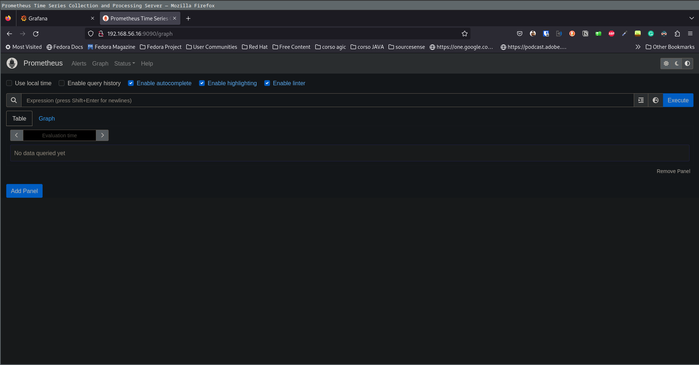

# sou-lab-cni: Prometheus + Grafana 

## Development

- Clone repository
- Ensure to have Vagrant and VirtualBox
- Run `vagrant up`

The last command create the boxes and provision the first one with Haproxy and the second one with Grafana and Prometheus using ansible. Once `vagrant up` is done you could find Grafana on [192.168.56.16:3000](http://192.168.56.16:3000) and Prometheus on [192.168.56.16:9090](http://192.168.56.16:9090).

## Screenshots

